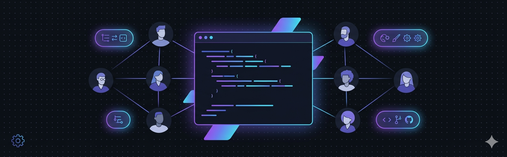

<div align="center">



# ⚙️ cursor-team-ops

**The team-ops layer for Cursor AI**

Roll out consistent agent rules, skills, and git guardrails across your entire engineering team — in under 5 minutes.

[](CHANGELOG.md)
[](LICENSE)
[](#install-once-per-machine)
[](CONTRIBUTING.md)
[](CODE_OF_CONDUCT.md)
[](SECURITY.md)

</div>

---

## Why this exists

Most Cursor setups are solo configurations — copied rules, hand-pasted skills, no enforcement. cursor-team-ops solves the team problem:

```text
git clone cursor-team-ops          →   bash install.sh          →   bash sync-project.sh
     ↓                                      ↓                              ↓
 get the kit                      rules + skills on             same setup in every
 on your machine                  your machine                  repo your team uses
```

One `git pull` on the kit keeps every developer and every repo in sync.

---

## What's included

| Layer | What it does |
|-------|-------------|
| 🛡️ **8 rules** | 5 always-on guardrails + 3 conditional rules (DB transactions, import boundaries, structured logging) |
| 🧠 **20 skills** | On-demand workflows — PR creation, ADRs, session handoffs, requirements synthesis, and more |
| 🪝 **4 hooks** | `git-guard.sh` · `db-migration-guard.sh` · `license-gatekeeper.sh` · `session-context.sh` |
| ⚡ **4 commands** | `/pr` · `/review` · `/fix-issue` · `/handoff` — starter slash commands for every repo |
| 📋 **Templates** | `AGENTS.md` + `project-context.mdc` scaffolded into every new repo |

---

## How it works

```text
~/.cursor/                          your-repo/.cursor/
├── rules/                          ├── rules/
│   ├── core-development.mdc        │   ├── core-development.mdc   ← team rules
│   ├── git-safety.mdc              │   ├── git-safety.mdc
│   ├── agent-behavior.mdc          │   ├── agent-behavior.mdc
│   ├── security-basics.mdc         │   ├── security-basics.mdc
│   ├── documentation.mdc           │   ├── documentation.mdc
│   ├── transaction-atomicity.mdc   │   ├── transaction-atomicity.mdc
│   ├── architectural-drift.mdc     │   ├── architectural-drift.mdc
│   └── telemetry-standards.mdc     │   └── project-context.mdc    ← yours to edit
├── skills/  (20 skills)            ├── skills/  (20 skills)
├── hooks/                          ├── commands/
│   ├── git-guard.sh                │   ├── pr.md
│   ├── db-migration-guard.sh       │   ├── review.md
│   ├── license-gatekeeper.sh       │   ├── fix-issue.md
│   └── session-context.sh          │   └── handoff.md
├── hooks.json                      └── hooks.json  (optional)
└── .team-kit-version
      ↑ install.sh                        ↑ sync-project.sh
```

---

## Quick start

### 1 — Install on your machine (once)

**macOS / Linux / Git Bash on Windows**

```bash
git clone https://github.com/SID-SURANGE/cursor-team-ops ~/cursor-team-ops
cd ~/cursor-team-ops
bash install.sh
```

**Windows — native PowerShell**

```powershell
git clone https://github.com/SID-SURANGE/cursor-team-ops $HOME\cursor-team-ops
cd $HOME\cursor-team-ops
.\install.ps1
```

> Restart Cursor after install.

### 2 — Set up a repo (per project)

```bash
cd /path/to/your/repo
bash ~/cursor-team-ops/bootstrap-project.sh   # scaffolds AGENTS.md + commands
bash ~/cursor-team-ops/sync-project.sh         # copies rules + skills into .cursor/
```

```powershell
# Windows PowerShell — run from your repo directory
cd C:\path\to\your\repo
bash "$HOME/cursor-team-ops/bootstrap-project.sh"
& "$HOME\cursor-team-ops\sync-project.ps1"
```

Then reload Cursor → `Ctrl+Shift+P` → **Developer: Reload Window** → check **Settings → Rules, Commands**.

### 3 — Commit and share with your team

```bash
# Edit these for your project first
nano AGENTS.md
nano .cursor/rules/project-context.mdc

git add .cursor/ AGENTS.md
git commit -m "chore: add cursor-team-ops baseline"
git push
# teammates get it on next git pull — no install needed beyond step 1
```

---

## Rolling out to a team

```text
Team lead                           Each developer
──────────                          ──────────────
1. git clone cursor-team-ops        1. git clone cursor-team-ops
2. bash install.sh  (once)          2. bash install.sh  (once)
3. bootstrap-project.sh + sync      3. git pull  (gets .cursor/ from repo)
4. edit AGENTS.md                   4. reload Cursor  ✓
5. git push
```

See [TEAMS.md](TEAMS.md) for complete examples: web app team, API team, monorepo.

---

## Rules

Five rules apply to every file in every session. Three additional rules apply conditionally based on file type.

**Always-on**

| Rule | Enforces |
|------|---------|
| `core-development` | Minimal diffs · match style · no placeholders · no over-engineering |
| `git-safety` | No force-push main · no `--no-verify` · commit only when asked |
| `agent-behavior` | Read before edit · use tools · concise output · no preamble |
| `security-basics` | No secrets in code · warn before staging sensitive files |
| `documentation` | Precise prose · no invented requirements · cite existing content |

**Conditional (file-type scoped)**

| Rule | Scope | Enforces |
|------|-------|---------|
| `transaction-atomicity` | `*.ts/.js/.py/.go/.rb/.java` | Multi-step DB writes must use explicit transaction wrappers |
| `architectural-drift` | `*.ts/.js/.py/.go/.java` | No cross-domain imports into private paths; defers to `.deprc.json` |
| `telemetry-standards` | `*.ts/.js/.py/.go/.java` | Structured logging objects required; plain string log calls blocked |

---

## Skills

Skills fire automatically when the agent detects a trigger phrase.

**Core skills**

| Skill | Say this to trigger it | What it does |
|-------|----------------------|-------------|
| `pre-commit-check` | *"commit this"* / *"create a commit"* | Audits staged changes for secrets, debug code, and unrelated files before committing |
| `commit-message` | *"write a commit message"* / *"conventional commit"* | Produces a Conventional Commits-compliant message inferred from the staged diff |
| `pr-summary` | *"open a PR"* / *"push and PR"* | Creates a PR with title, summary, and test plan from all commits on the branch |
| `minimal-diff-review` | *"review my changes"* / *"check the diff"* | Reviews changes for scope creep, convention drift, and quality issues |
| `pr-review-canvas` | *"review canvas"* / *"map this PR"* | Groups PR changes by purpose, flags risky sections, and produces a reviewer map |
| `requirements-qa` | *(auto — when working in BRD / docs / requirements folders)* | Flags invented content, conflicts, and open questions in requirements documents |
| `architecture-decision-records` | *"create an ADR"* / *"document this decision"* | Captures architectural decisions in a standard ADR template |
| `deslop` | *"deslop"* / *"clean this up"* / *"remove dead code"* | Strips narrating comments, dead imports, and pointless try/catch blocks |
| `sync-docs-after-edit` | *"sync docs"* / *"did my change break any docs?"* | Scans all markdown files after code changes and flags stale or contradicted docs |
| `document-this` | *"document this"* / *"add a why-comment"* | Adds why-only comments that explain intent and constraints, not what the code does |
| `write-changelog` | *"write a changelog entry"* / *"update CHANGELOG"* | Generates a Keep-a-Changelog entry from commit history |
| `handoff` | *"generate handoff"* / *"close session"* | Documents progress, root causes, failed attempts, and next steps for session handoff |
| `commit-history-audit` | *"audit my commits"* / *"check commit history before PR"* | Audits all commits on the branch for WIP markers, wrong convention, overlength subjects, and merge commits that should be squashed. Self-calibrates to the repo's own commit style — never imposes Conventional Commits on a free-form repo. |
| `release-readiness` | *"am I ready to release"* / *"can I ship this"* / *"is this ready to merge"* | Detects workflow mode (formal release with tags vs. continuous deployment from main) and runs the matching checklist — 4 gates for CD teams, 8 gates for versioned projects. |
| `env-drift-check` | *"env drift"* / *"why does it work locally but not in CI"* | Cross-references `.env.example` keys vs. code, runtime version across `.nvmrc`/CI matrix/Docker, CI secret coverage, and Docker lockfile consistency. |

### Community skills

| Skill | Triggered by | What it does |
|-------|-------------|-------------|
| `workflow-from-chats` | *"make this a skill"* | Turns a repeated conversation pattern into a committable `SKILL.md` |
| `spec-driven-development` | *"write a spec"* / *"spec this out"* | Writes a structured spec before any code is touched |
| `security-hardening` | *"security review"* / *"harden this"* | Reviews code against OWASP Top 10 patterns |
| `ci-cd-pipeline` | *"set up CI"* / *"fix the pipeline"* | Scaffolds or repairs a quality-gate pipeline with lint, tests, build, and security audit |
| `requirements-synthesis` | *"synthesize these requirements"* | Ingests PDFs, DOCX, and other client docs into a single structured requirements draft |

See [skills/community/ATTRIBUTIONS.md](skills/community/ATTRIBUTIONS.md) for full attribution details. [Contribute a skill →](CONTRIBUTING.md)

> **Skills vs. commands** — Skills are auto-triggered by the agent. Commands (`/pr`, `/review`, `/fix-issue`, `/handoff`) are typed manually with `/` in the agent input.

---

## Hooks

| Hook | Event | Behaviour |
|------|-------|-----------|
| `git-guard.sh` | `beforeShellExecution` | **Blocks** force-push to main/master · **warns** on hard reset, `--no-verify`, root `rm -rf` |
| `db-migration-guard.sh` | `beforeShellExecution` | **Blocks** commits with DROP COLUMN, NOT NULL without default, non-CONCURRENT index, DROP TABLE, TRUNCATE |
| `license-gatekeeper.sh` | `beforeShellExecution` | **Blocks** commits adding GPL/AGPL/LGPL/SSPL/EUPL licensed packages |
| `session-context.sh` | `sessionStart` | Injects kit version + active rules/skills/hooks list at session start |

See [hooks/README.md](hooks/README.md) for schema reference, testing guide, and how to add project-level hooks.

---

## Keeping in sync

```bash
# When the kit releases a new version
cd ~/cursor-team-ops && git pull
bash install.sh                          # update your machine
bash sync-project.sh /path/to/your/repo  # update the repo
git add .cursor/ && git commit -m "chore: sync cursor-team-ops to vX.Y.Z" && git push
# teammates get the update on next git pull
```

The `session-context.sh` hook prints the active kit version at every session start — mismatches are visible immediately.

---

## Cursor Settings UI note

**Settings → Rules, Commands** shows **project** files only (`<repo>/.cursor/`). Machine-level files (`~/.cursor/`) are active but not listed in the panel — this is expected. Run `sync-project.sh` in the repo to make rules and skills appear in Settings.

---

## Contributing

Community skills are welcome. Rules, hooks, and install scripts are maintainer-only.

See [CONTRIBUTING.md](CONTRIBUTING.md) for the quality bar, `SKILL.md` format, and submission steps.

---

## Governance

- **Core changes** — PR + `CHANGELOG.md` entry, maintainer approval
- **Community skills** — PR reviewed against the quality bar in `CONTRIBUTING.md`
- **Quarterly review** — trim rules the agent ignores; promote proven community skills to core
- **Versioning** — tagged releases; `sessionStart` hook prints the active version

---

## Attributions

One core skill (`architecture-decision-records`) was inspired by [awesome-cursor-skills](https://github.com/spencerpauly/awesome-cursor-skills) (Spencer Pauly). Three community skills were informed by [agent-skills](https://github.com/addyosmani/agent-skills) (Addy Osmani, MIT). No text was copied from either source. Full details: [skills/community/ATTRIBUTIONS.md](skills/community/ATTRIBUTIONS.md).

> This kit is **unofficial** and not affiliated with or endorsed by Anysphere (Cursor). "Cursor" is a trademark of Anysphere, Inc.
