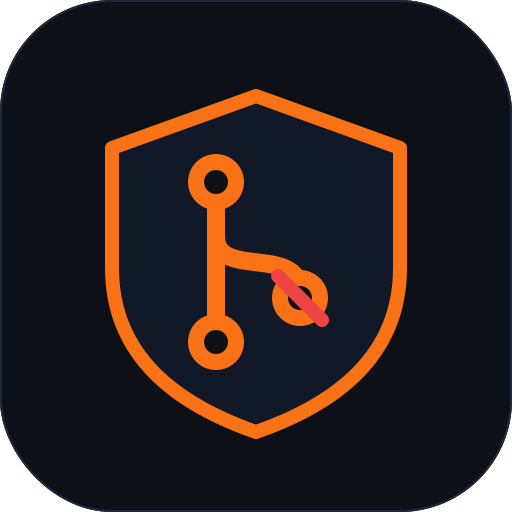

# Git Guardrails

**Blocking hooks that stop dangerous actions before they run — not after.**

Rules and `AGENTS.md` are *advice*: the agent can read them and still do the
thing. Guardrails are *policy*: they run as `beforeShellExecution` hooks and can
return `deny`, so the dangerous command never executes. This plugin ships three
hard blocks plus the git-safety rule that documents the intent behind them.

## What it blocks

| Hook | Event | Behaviour |
|------|-------|-----------|
| `git-guard.sh` | `beforeShellExecution` | **Denies** direct pushes to `main`/`master` and force-pushes to `main`/`master`; **asks** before force-push to other branches, `git reset --hard`, and `--no-verify`/`--no-gpg-sign`; **denies** `rm -rf` on `/`, `~`, `/home`, `/root`. |
| `db-migration-guard.sh` | `beforeShellExecution` (on `git commit`) | **Denies** commits containing destructive migration patterns: `DROP COLUMN`, `NOT NULL` without a default, non-`CONCURRENT` index creation, `DROP TABLE`, `TRUNCATE`. |
| `license-gatekeeper.sh` | `beforeShellExecution` (on `git commit`) | **Denies** commits that add packages under copyleft licenses (GPL-2/3, AGPL-3, LGPL, SSPL, EUPL) on lockfile changes. |

It also installs the `git-safety` rule (`rules/git-safety.mdc`): commit only when
asked, feature-branch discipline, safe amend policy, and HEREDOC commit messages.

## Why hooks, not just rules

A rule tells the agent *"don't push to main."* A hook makes the push
**physically fail**. When you're rolling standards out to a team — especially
one with juniors or many parallel agents — advice that can be ignored is not a
control. These three hooks are the controls that Cursor's built-in rules and the
official skill packs don't provide.

## Install

**Via Team Marketplace** (Teams/Enterprise): import
`SID-SURANGE/cursor-team-ops` under **Dashboard → Plugins → Import from Repo**,
then enable **Git Guardrails**.

**Via the Marketplace browser**: search for *Git Guardrails* and install.

Restart Cursor after installing so the hooks register.

## Hook protocol

Each hook reads the shell payload on stdin and emits one JSON line:

- `{"permission":"allow"}` — proceed
- `{"permission":"deny","user_message":"…","agent_message":"…"}` — hard block
- `{"permission":"ask","user_message":"…","agent_message":"…"}` — prompt the user

`failClosed` is `false`, so a hook error never blocks legitimate work — it fails
open and allows the command.

## Part of cursor-team-ops

This plugin is one of the [cursor-team-ops](https://github.com/SID-SURANGE/cursor-team-ops)
enforcement plugins. It is also available as plain shell scripts for teams not on
a Cursor plan that supports plugins — see the root repository.

## License

MIT — see [LICENSE](LICENSE).
